# Architecture Overview

Pteronimbus is designed as a **cloud-native, multi-tenant game server hosting platform** that leverages Kubernetes primitives for scalability, reliability, and security.

## Design Principles

### 🎯 Kubernetes-Native First
All game servers are represented as Kubernetes Custom Resources, enabling full integration with the Kubernetes ecosystem.

### 🔒 Security by Design
Multi-tenant isolation, fine-grained RBAC, and principle of least privilege throughout the system.

### 🔄 Pull-Based Architecture
The controller operates on a pull-based reconciliation model, ensuring eventual consistency.

### 📏 Separation of Concerns
Clear boundaries between user interface, business logic, and infrastructure management.

## System Architecture

```mermaid
graph TB
    subgraph "User Layer"
        Users[👥 Users]
        WebUI[🖥️ Web Interface]
        CLI[⌨️ kubectl/CLI]
    end
    
    subgraph "Application Layer"
        Frontend[Frontend<br/>Nuxt.js]
        Backend[Backend API<br/>Go + Gin]
        Database[(Database<br/>PostgreSQL)]
        Auth[Authentication<br/>Authentik OIDC]
    end
    
    subgraph "Platform Layer"
        Controller[Controller<br/>Kubernetes Operator]
    end
    
    subgraph "Infrastructure Layer"
        CRDs[GameServer CRDs]
        Pods[Game Server Pods]
        Storage[Persistent Storage]
        Network[Load Balancers]
    end
    
    Users --> WebUI
    Users --> CLI
    WebUI --> Frontend
    Frontend --> Backend
    Backend --> Auth
    Backend --> Database
    Backend --> Controller
    CLI --> CRDs
    Controller --> CRDs
    Controller --> Pods
    Pods --> Storage
    Pods --> Network
```

## Component Overview

### Frontend (Nuxt.js)
- **Purpose**: Modern, responsive web interface for game server management
- **Technology**: Nuxt.js with TypeScript
- **Responsibilities**:
  - User authentication flow
  - Game server creation and management UI
  - Real-time status monitoring
  - Resource usage visualization

### Backend API (Go)
- **Purpose**: Central business logic and API gateway
- **Technology**: Go with Gin framework
- **Responsibilities**:
  - User authentication and authorization
  - RBAC policy enforcement
  - Game server manifest generation
  - Database operations
  - API rate limiting and validation

### Controller (Kubernetes Operator)
- **Purpose**: Kubernetes-native game server lifecycle management
- **Technology**: Go with controller-runtime
- **Responsibilities**:
  - Watch GameServer CRDs for changes
  - Reconcile desired vs actual state
  - Manage pod lifecycle (create, update, delete)
  - Health monitoring and auto-recovery
  - Resource quota enforcement

### Custom Resource Definitions (CRDs)
- **Purpose**: Kubernetes-native representation of game servers
- **Technology**: Kubernetes API extensions
- **Benefits**:
  - Declarative configuration
  - Native kubectl support
  - Built-in validation and defaulting
  - Event-driven reconciliation

## Data Flow

### 1. Game Server Creation

### 2. Status Updates

## Security Model

### Authentication
- **OIDC Integration**: Authentik provides centralized authentication
- **JWT Tokens**: Stateless authentication with short-lived tokens
- **Multi-Provider Support**: Extensible to other OIDC providers

### Authorization
- **RBAC**: Role-based access control with fine-grained permissions
- **Multi-Tenant**: Strict resource isolation between tenants
- **Principle of Least Privilege**: Users only get minimum required permissions

### Network Security
- **TLS Everywhere**: All communication encrypted in transit
- **Network Policies**: Kubernetes-native network segmentation
- **Service Mesh Ready**: Compatible with Istio/Linkerd for advanced networking

## Scalability Considerations

### Horizontal Scaling
- **Stateless Components**: Frontend and Backend can scale horizontally
- **Database**: PostgreSQL with read replicas for scaling reads
- **Controller**: Single active controller with leader election

### Multi-Cluster Support
- **Federation Ready**: Architecture supports multiple Kubernetes clusters
- **Regional Deployment**: Controllers can manage clusters across regions
- **Cross-Cluster Networking**: Support for game servers across clusters

## Operational Excellence

### Observability
- **Metrics**: Prometheus metrics for all components
- **Logging**: Structured logging with correlation IDs
- **Tracing**: Distributed tracing for request flows
- **Health Checks**: Kubernetes-native liveness and readiness probes

### Reliability
- **Circuit Breakers**: Fail-fast patterns for external dependencies
- **Graceful Degradation**: System continues operating with reduced functionality
- **Auto-Recovery**: Controller handles pod failures automatically
- **Backup & Restore**: Automated backup of game server data

## Next Steps

- [Backend Architecture](/docs/architecture/backend) - Deep dive into the API server
- [Controller Architecture](/docs/architecture/controller) - Understanding the Kubernetes operator
- [Security Model](/docs/architecture/security-model) - Detailed security implementation
- [Development Setup](/docs/architecture/development/setup) - Setting up a development environment 