# Controller Overview

The **Pteronimbus Controller** is a Kubernetes-native operator that manages game server lifecycles through Custom Resource Definitions (CRDs). It operates in a pull-based reconciliation loop, watching for changes to `GameServer` resources and ensuring the actual cluster state matches the desired state.

## Purpose

The controller is the bridge between the user-facing backend API and the underlying Kubernetes infrastructure. It:

- **Watches Custom Resources**: Monitors `GameServer` CRDs for changes
- **Reconciles State**: Ensures actual pods/services match desired configuration  
- **Reports Status**: Updates CRD status fields with deployment information
- **Manages Resources**: Creates, updates, and deletes Kubernetes resources
- **Handles Cleanup**: Ensures proper resource cleanup when game servers are deleted

## Architecture Role

```mermaid
graph TB
    Backend[🔧 Backend API] --> CRDs[📋 GameServer CRDs]
    Controller[⚙️ Controller] --> CRDs
    Controller --> Pods[🎮 Game Server Pods]
    Controller --> Services[🌐 Services]
    Controller --> PVCs[💾 Storage]
    
    style Controller fill:#e1f5fe
    style CRDs fill:#f3e5f5
```

The controller operates independently from the backend, using Kubernetes APIs exclusively. This separation ensures:

- **Scalability**: Controller can run on different nodes
- **Security**: No direct backend access to cluster credentials
- **Reliability**: Controller continues operating even if backend is down
- **Multi-cluster**: Future support for federated deployments

## Current Implementation

**🚧 Early Development** - The controller currently provides:

- ✅ **Health Check Endpoints**: Standard Kubernetes health checks
- ✅ **Basic HTTP Server**: Foundation for controller operations
- 🔄 **CRD Management**: *Planned*
- 🔄 **Reconciliation Logic**: *Planned*  
- 🔄 **Resource Management**: *Planned*

## Next Steps

1. **Define GameServer CRD**: Custom resource schema
2. **Implement Controller Logic**: Reconciliation loop using controller-runtime
3. **Add Resource Management**: Pod, Service, PVC creation
4. **Status Reporting**: Update CRD status fields
5. **Event Handling**: Kubernetes events for debugging 