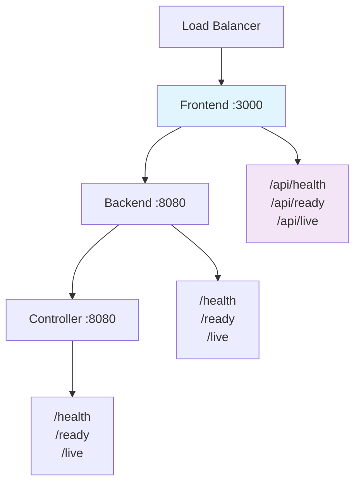

# Frontend Health Checks

The Pteronimbus frontend provides comprehensive health check endpoints for monitoring and Kubernetes integration. Built with Nuxt 3 and Nitro server, these endpoints enable proper observability in containerized environments.

## Health Endpoints

The frontend exposes the following health check endpoints on port **3000**:

| Endpoint | Purpose | Use Case |
|----------|---------|----------|
| `/api/health` | General health status | Load balancer health checks |
| `/api/healthz` | Kubernetes-style health | Standard k8s health endpoint |
| `/api/ready` | Readiness probe | Service ready to handle requests |
| `/api/live` | Liveness probe | Process is alive and responsive |

## Endpoint Details

### `/api/health` and `/api/healthz`

General health check endpoints that return the frontend's operational status.

**Response:**
```json
{
  "status": "healthy",
  "timestamp": "2025-07-08T20:51:30.321Z",
  "service": "pteronimbus-frontend",
  "version": "0.1.0"
}
```

**HTTP Status:** `200 OK`

### `/api/ready`

Readiness probe endpoint indicating the frontend is ready to serve traffic and handle user requests.

**Response:**
```json
{
  "status": "ready",
  "timestamp": "2025-07-08T20:51:30.321Z",
  "service": "pteronimbus-frontend"
}
```

**HTTP Status:** `200 OK`

### `/api/live`

Liveness probe endpoint confirming the frontend process is alive and responding.

**Response:**
```json
{
  "status": "alive",
  "timestamp": "2025-07-08T20:51:30.321Z",
  "service": "pteronimbus-frontend"
}
```

**HTTP Status:** `200 OK`

## Usage Examples

### Testing Health Endpoints

```bash
# General health check
curl http://localhost:3000/api/health

# Kubernetes-style health check  
curl http://localhost:3000/api/healthz

# Readiness probe
curl http://localhost:3000/api/ready

# Liveness probe  
curl http://localhost:3000/api/live
```

### Expected Responses

**General Health** (`/api/health`, `/api/healthz`):
```json
{
  "status": "healthy",
  "timestamp": "2025-07-08T20:51:30.321Z",
  "service": "pteronimbus-frontend",
  "version": "0.1.0"
}
```

**Readiness Probe** (`/api/ready`):
```json
{
  "status": "ready",
  "timestamp": "2025-07-08T20:51:30.321Z",
  "service": "pteronimbus-frontend"
}
```

**Liveness Probe** (`/api/live`):
```json
{
  "status": "alive",
  "timestamp": "2025-07-08T20:51:30.321Z",
  "service": "pteronimbus-frontend"
}
```

## Kubernetes Integration

These endpoints are designed for Kubernetes health checks in your deployment manifests:

```yaml
apiVersion: apps/v1
kind: Deployment
metadata:
  name: pteronimbus-frontend
spec:
  template:
    spec:
      containers:
      - name: frontend
        image: pteronimbus/frontend:latest
        ports:
        - containerPort: 3000
        livenessProbe:
          httpGet:
            path: /api/live
            port: 3000
          initialDelaySeconds: 10
          periodSeconds: 10
        readinessProbe:
          httpGet:
            path: /api/ready
            port: 3000
          initialDelaySeconds: 5
          periodSeconds: 5
```

## Development

### Running the Service

```bash
cd apps/frontend
npm install
npm run dev
```

The service starts on port 3000 and immediately responds to health checks.

### Testing

The health endpoints include comprehensive test coverage:

```bash
# Run tests (requires dev server running)
npm test
```

**Test Coverage:**
- ✅ Status responses match expected values
- ✅ Service identification verification
- ✅ Version information validation
- ✅ JSON content type headers
- ✅ Consistent ISO timestamp format
- ✅ Timestamp recency validation

## Implementation Details

The health check endpoints are implemented as Nuxt API routes in `server/api/` with:

- **Server-side rendering**: Full SSR support for authenticated routes
- **Nitro server**: Built on Nuxt's high-performance server engine
- **Graceful shutdown**: Proper cleanup on process termination
- **Structured responses**: Consistent JSON format across all endpoints
- **HTTP status codes**: Proper 200 OK responses for healthy state
- **Timestamps**: UTC timestamps for monitoring and debugging
- **Service identification**: Clear service name and version info

### File Structure

```
apps/frontend/
├── server/
│   └── api/
│       ├── health.get.ts      # General health endpoint
│       ├── healthz.get.ts     # Kubernetes-style health
│       ├── ready.get.ts       # Readiness probe
│       └── live.get.ts        # Liveness probe
├── test/
│   └── health.test.ts         # Comprehensive test suite
└── vitest.config.ts           # Test configuration
```

## Architecture Integration

The frontend health checks are part of the broader Pteronimbus monitoring strategy:



This foundation provides the monitoring and health check capabilities needed for the full Pteronimbus system as the frontend continues to evolve with authentication and game server management features. 