# Pteronimbus 🦖

Pteronimbus is a **Kubernetes-native game server hosting platform** currently in early development. This documentation covers the architectural concepts and components as they are built.

## Current Status

**🚧 In Development** - This project is in the early stages of development.

### What's Built
- ✅ **Backend Service**: Basic Go HTTP service with health check endpoints
- ✅ **Architecture Design**: System design and component definitions

### What's Planned
- 🔄 **Kubernetes Controller**: CRD-based game server management
- 🔄 **Frontend**: Web interface for game server management  
- 🔄 **Authentication**: OIDC integration with RBAC
- 🔄 **Game Server Templates**: Minecraft, Valheim, and custom server support

## Architecture Vision

Pteronimbus will consist of four main components:

```mermaid
graph TB
    Users[👥 Users] --> Frontend[🖥️ Frontend<br/>Nuxt.js]
    Frontend --> Backend[🔧 Backend API<br/>Go]
    Backend --> Database[(🗄️ Database)]
    Backend --> Controller[⚙️ Controller<br/>Kubernetes Operator]
    Controller --> CRDs[📋 GameServer CRDs]
    Controller --> Pods[🎮 Game Server Pods]
```

## Design Principles

- **Kubernetes-Native**: Game servers as Custom Resources
- **Security First**: Multi-tenant with fine-grained RBAC  
- **Pull-Based**: Controller reconciliation model
- **Separation of Concerns**: Clear component boundaries

## Current Documentation

- [Architecture Overview](/docs/architecture/overview) - Detailed system design
- [Backend Health Checks](/docs/backend/health-checks) - Current backend implementation

---

*This project is open source and contributions are welcome as development progresses.* 